# JODTool チュートリアル

## 目次

* [JODTool とは](#ＪＯＤＴｏｏｌとは)
* [JODTool のインストール](#ＪＯＤＴｏｏｌのインストール)
* [ツール画面](#ツール画面)
* [仕様記述開始](#仕様記述開始)
* [プロジェクトの作成](#プロジェクトの作成)
* [ファイルの追加](#ファイルの追加)
* [フォーマルな用語辞書の設定](#フォーマルな用語辞書の設定)
* [自然言語テキストの分析](#自然言語テキストの分析)
* [要求文書の読み込み](#要求文書の読み込み)
* [自然言語による意味定義](#自然言語による意味定義)
* [自然言語による要求の整理](#自然言語による要求の整理)
    * [キーフレーズの抽出](#キーフレーズの抽出)
    * [キーフレーズの自然言語による定義](#キーフレーズの自然言語による定義)
    * [キーフレーズの構造定義，関連整理](#キーフレーズの構造定義，関連整理)
* [ VDM による意味定義](#ＶＤＭによる意味定義)
    * [見出しに対応する VDM の要素記述](#見出しに対応するＶＤＭの要素記述)
    * [検証可能なモデルの出力と文法および型検査による検証](#検証可能なモデルの出力と文法および型検査による検証)
* [実行可能モデルの実行](#executeVDM)
* [モデルの改良](#refineVDM)
* [まとめ](#summary)

##ＪＯＤＴｏｏｌとは

[JODTool](http://aofa.csce.kyushu-u.ac.jp/JODTool) は VDM モデルの要素と RFP(Request For Proposal) など自然言語による記述を対応づけるフォーマルな用語辞書の管理ツールであり， [Overture tools](http://overturetool.org) 上で動作する．
最新版は [JODTool のサイト](http://aofa.csce.kyushu-u.ac.jp/JODTool) よりダウンロード可能である．

この文書は  [JODTool](http://aofa.csce.kyushu-u.ac.jp/JODTool) を追加した [Overture tools](http://overturetool.org) による VDM モデル記述方法の解説である．
つまり， [JODTool](http://aofa.csce.kyushu-u.ac.jp/JODTool) 単独の説明ではなく，簡単な [Overture tools](http://overturetool.org) の使い方も含めて説明する．
 [JODTool](http://aofa.csce.kyushu-u.ac.jp/JODTool) はプレーンな [Eclipse](http://eclipse.org) 上にセットアップし単独での利用も可能であるが， [Overture tools](http://overturetool.org) との協調により大きな効果を発揮する．

##ＪＯＤＴｏｏｌのインストール

動作している [Overture tools](http://overturetool.org) に [JODTool](http://aofa.csce.kyushu-u.ac.jp/JODTool) をインストールするのは容易である．
まず [Overture tools のダウンロードサイト](http://overturetool.org/download/) から利用環境に応じたバイナリをダウンロードし，インストールする．
最新の安定版は 2.3.2 であり， MacOS X, Windows(32 ビット， 64 ビット), Linux(32 ビット， 64 ビット) をサポートする．
 [Overture tools](http://overturetool.org) は [Eclipse](http://eclipse.org) のプラグインであり，それぞれの環境で動作する JRE/JDK が必要である．
事前に JRE/JDK がインストールされていない場合は，[Overture tools](http://overturetool.org) に同梱のバージョンが使用される．

###オンラインインストール

 [Overture tools](http://overturetool.org)-2.3.0 から標準で新規ソフトウェア追加の場所として [JODTool](http://aofa.csce.kyushu-u.ac.jp/JODTool) のサイトが登録されている．
したがって，ネットワーク接続が有効な場合，わずかな手間で [JODTool](http://aofa.csce.kyushu-u.ac.jp/JODTool) が利用できる．

すなわち， [Overture tools](http://overturetool.org) を起動し，メニューバーから Help -> Install New Software... と進み，

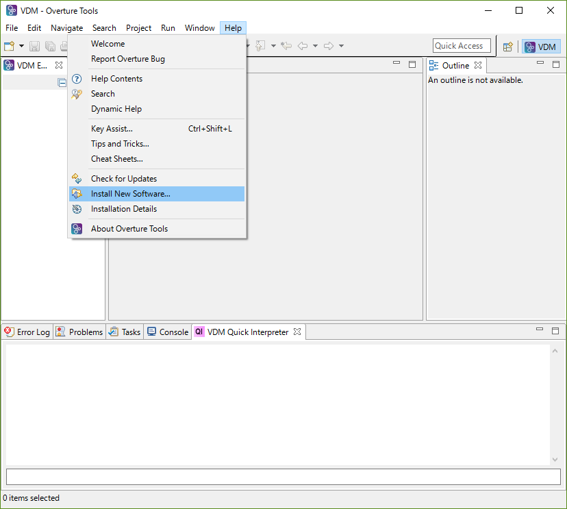

Work with のところで，欄右の▽をクリックし[JODTool](http://aofa.csce.kyushu-u.ac.jp/JODTool) を選択する．

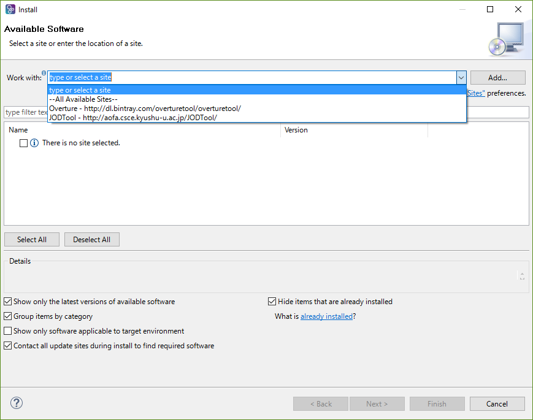

続いて， Name 欄でインストールするパッケージを選択する．
日本語化パックは，メニューなどを日本語化するオプションである．

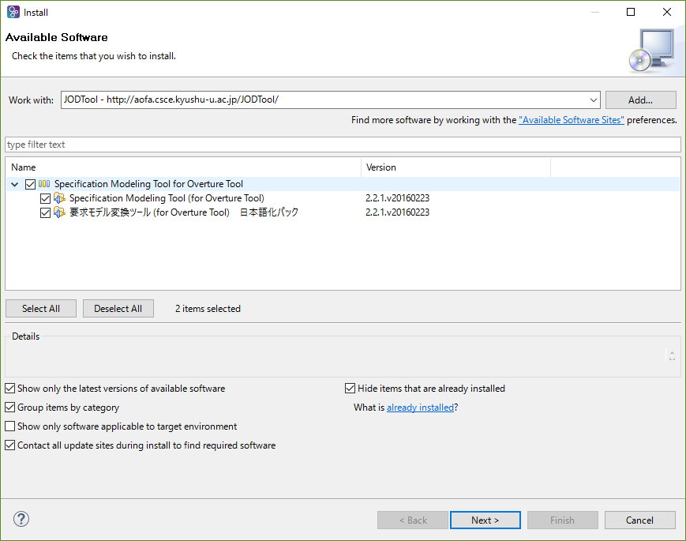

以下，ウィザードに沿って進めればインストールが完了する<a id="rfootnote1">[1](#footnote1)</a>．

###オフラインインストール

ネットワーク接続が利用できない場合，予めダウンロードした [JODTool.zip](http://aofa.csce.kyushu-u.ac.jp/JODTool/JODTool.zip) を展開し，メニューバーから Help -> Install New Software... と進み， Work with のところで新規ソフトウェア追加元として，展開したフォルダを指定する．
以下，オンラインインストールの場合と同じである．

作業後に[Overture tools](http://overturetool.org) を再起動し，メニューバーから Help -> About Overture Tools -> installation detail を選択したとき，

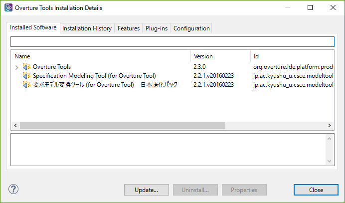

のように表示されていればインストールは成功している．

##ツール画面

 [Overture tools](http://overturetool.org) の画面構成は個々の機能に対応した表示部であるビューの集合であるパースペクティブと呼ばれる．
 VDM 記述で利用する VDM パースペクティブはファイラーである VDM Explorer, 編集作業を行う Editor, Dictionary, Dictionary Editor の各ビューからなる．

 画面](GUI.png)

なんらかの理由で表示されていない view がある場合，メニューバーから Window -> Show View -> Others と選択し，要求モデル変換ツール (Requirement Model Conversion Tool) から辞書に関する View を指定すればよい．
出現時に他のビューにタブとして隠れている場合もあるので注意する．

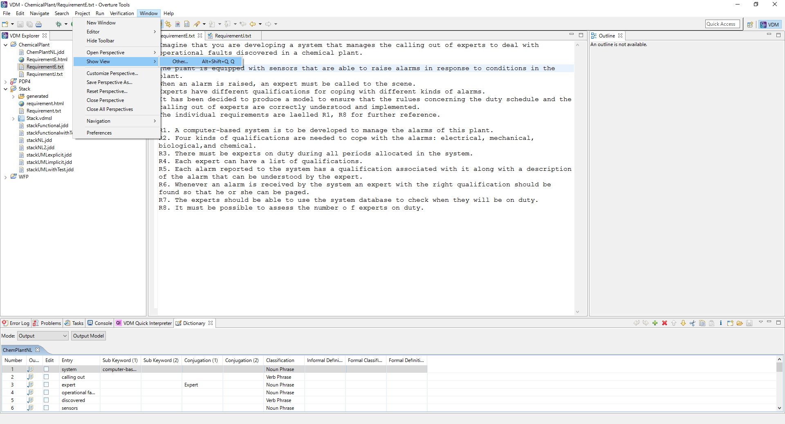

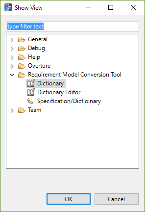

##仕様記述開始

[Overture tools](http://overturetool.org) および [JODTool](http://aofa.csce.kyushu-u.ac.jp/JODTool) のインストールが終わっている場合，プロジェクト作成から始める．

##プロジェクトの作成

 [Overture tools](http://overturetool.org) では，異なる開発対象のモデル記述をプロジェクトという単位で管理する．
新規プロジェクトを開始するにはメニューバーから File -> New -> Other と進むか， VDM Explorer 上で右クリック (MacOS X では Ctrl+クリック，以下同様) することで， VDM の各言語プロジェクトを作成できる．

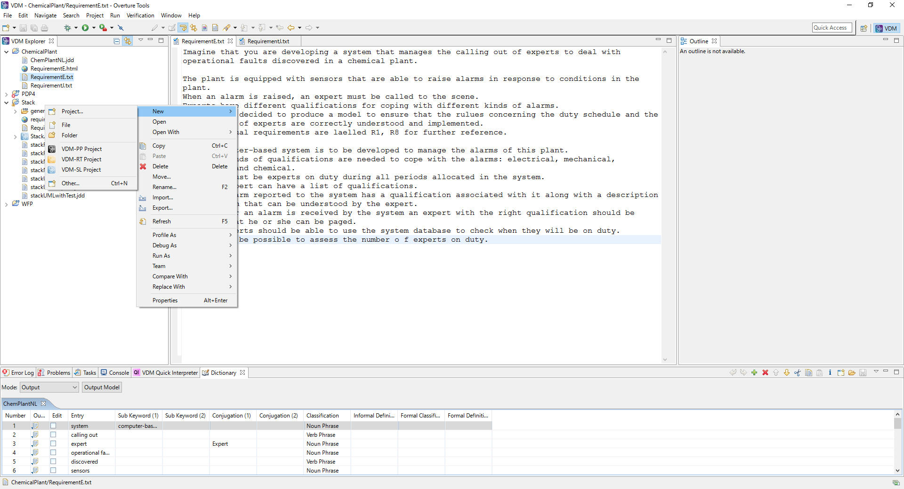

 VDM の各言語を選択して作成したプロジェクトは名前をつけて区別する．
 VDM の言語が異なるだけの同じ名前のプロジェクトは作成できない．

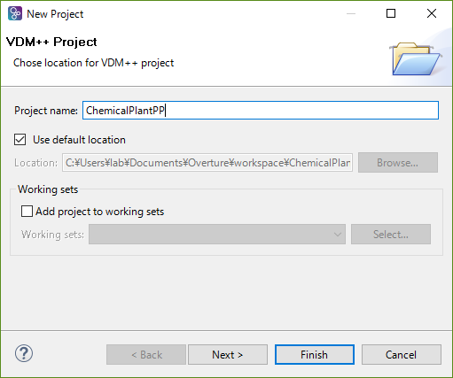

モデルの検証はプロジェクト単位で行われる．
用意されているライブラリを追加するときは， VDM Explorer 上のプロジェクトを選択し，右クリックで New -> Add VDM Library から選択することで， Math, IO などのライブラリをプロジェクト単位で利用できる．

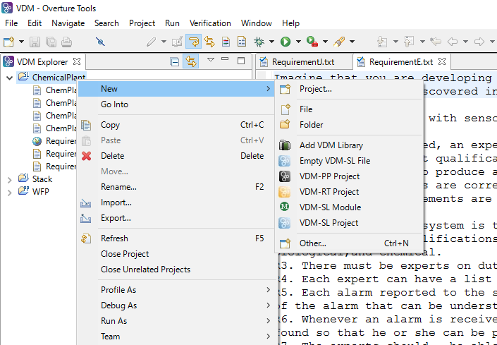

 VDM Explorer 上のプロジェクトを選択し，右クリックで Export... を選択すると，プロジェクト単位で [Overture tools](http://overturetool.org) の管理しないフォルダへエクスポートできる．
出力先は Export... -> General -> File System と選択し，フォルダ名を入力するか， Browse ボタンから選ぶことで指定する．
エクスポートしても元のプロジェクトはそのままであるので，スナップショットをとることができる．

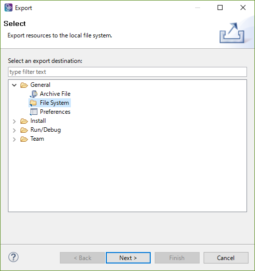

 VDM Explorer 上のプロジェクトを選択し，右クリックで Delete を選択すると，プロジェクトを削除できる．

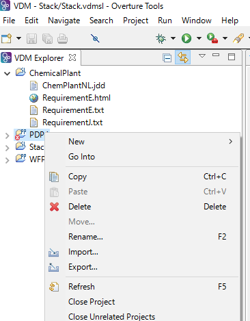

プロジェクトのデータを完全に削除する場合チェックを入れる．
プロジェクトを VDM Explorer から削除するだけの場合，ディスク上にデータは残っているので削除したプロジェクトを復活できるが，ツールから見えないデータが残ることになるので注意する必要がある．

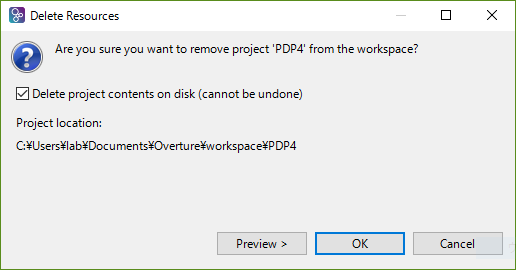

**このチュートリアルでは VDM-SL のプロジェクトを作成し， Chemical Plant 等の名前をつける**

##ファイルの追加

 [Overture tools](http://overturetool.org) のプロジェクトに既存のファイルを追加するには， VDM Explorer 上のプロジェクトを選択し，右クリックで Import... -> File System と選択し，

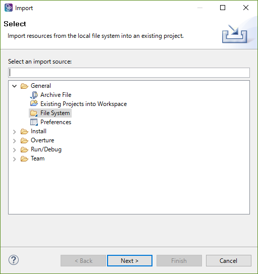

指定したディレクトリ(フォルダ) から選択したファイルを選択したプロジェクトへ追加できる．
ファイル追加の際には事前にプロジェクトを作成しておく必要がある．
 Browse... ボタンを押すとマウスによる操作も可能である．

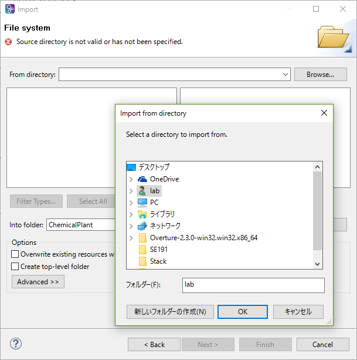

同様に Import -> Existing Projects into Workspace を選択し，エクスポートしたプロジェクトをインポートすることもできる．

##フォーマルな用語辞書の設定

プロジェクトを作成し Dictionary View を開くと，自動的に Default という名前の辞書が作成される．
最初に辞書名のタブ上で右クリックし辞書名を変更する．

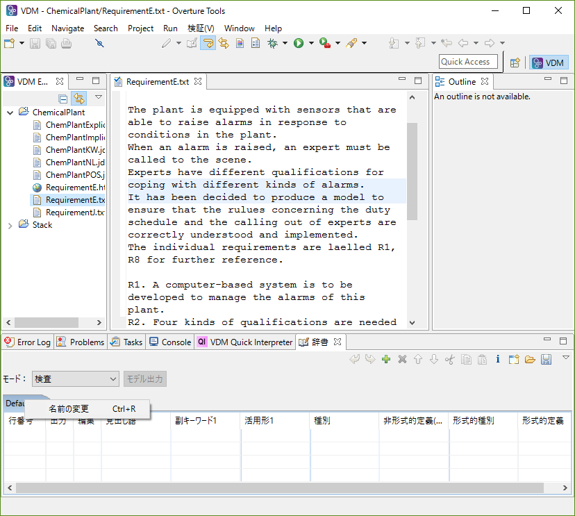

次に Dictionary View 右上にあるツールバーの i ボタンを押し，辞書情報タブからプロパティを設定する．

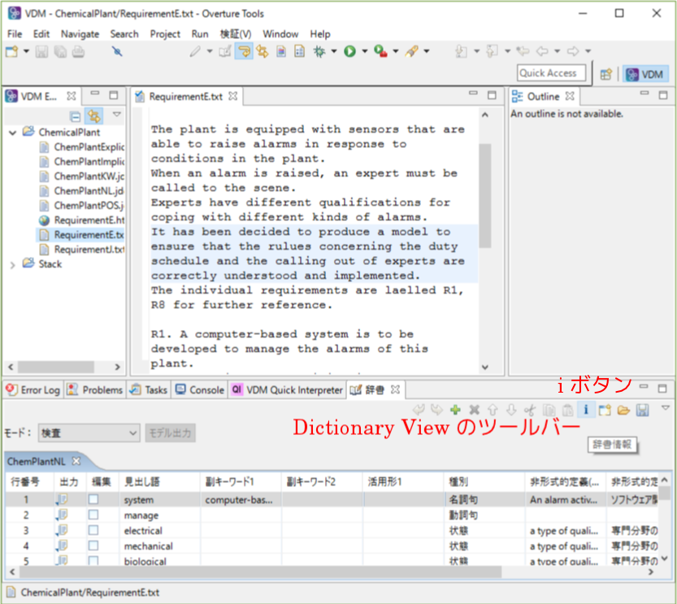

辞書のプロパティのうち，問題領域はモデル化対象の問題領域名，プロジェクト名は辞書を利用する組織名，入力言語は入力となる自然言語，出力モデルは出力となる VDM の各言語を設定する．

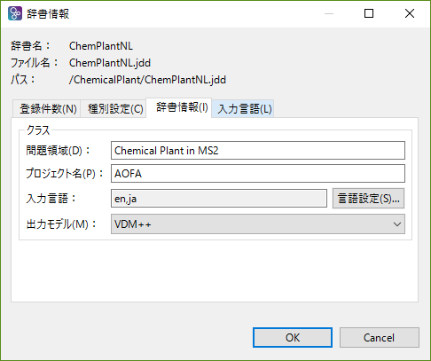

* 問題領域　(Problem Domain)　はモデル化対象の問題領域名であり，任意の文字列を入力できる．
モデル記述者が辞書を再利用する際のヒントなどが期待される．
デフォルトは空で省略可能である．

* プロジェクト名 (Project Name) は辞書を利用する組織名であり，任意の文字列を入力できる．
同じ対象であっても異なる組織では異なる辞書が利用され得ることから，辞書を使う場合のヒントとして期待される．
デフォルトは空で省略可能である．

* 入力言語 (Input Language) は入力となる自然言語である．
言語設定 (Language Setting...) から 2 letter code で選択することができる． 
最大 5 つの入力言語を設定可能であり，入力言語に応じてフォーマルな用語辞書の非形式的定義 (Informal Definition) のコラムが拡張される．
複数の自然言語による RFC に対して，同じ VDM 記述要素を対応させることにより，ある概念を異なる自然言語間で VDM を介して対応づけることができる．
デフォルトは OS の言語である．

* 出力モデル (Output Model) は出力となる VDM の記述言語である VDM-SL, VDM++, VDM-RT のいずれかを選択する．
当然，この言語は保存先のプロジェクトと一致していることが期待される．

プロパティを設定した辞書は各プロジェクトのフォルダに保存しておくのがお勧めである．
フォーマルな用語辞書の拡張子は jdd である．

新規に辞書を作成するには Dictionary View 右上にあるツールバーの New ボタンを押す．

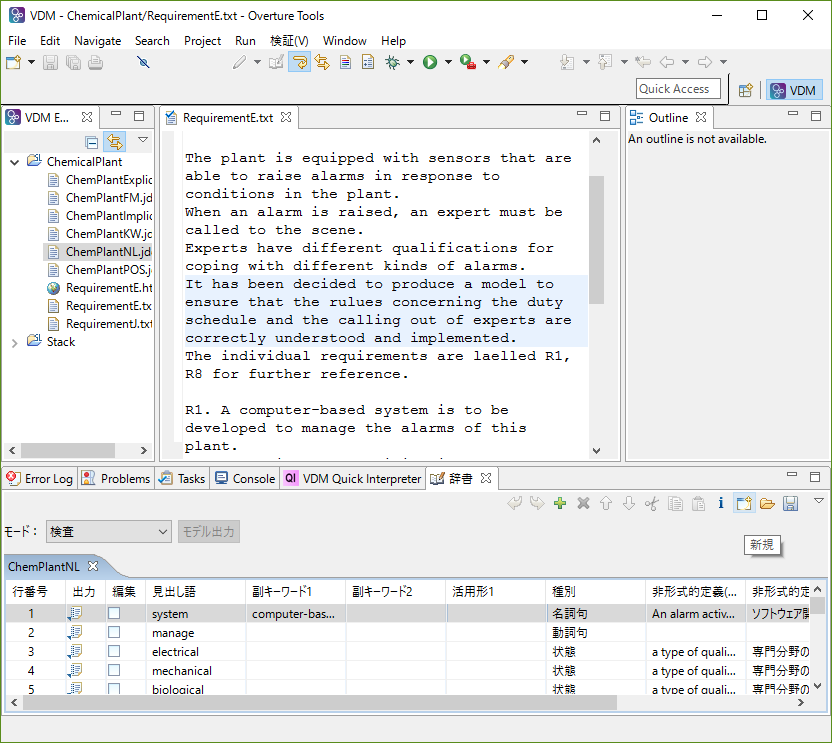

新規に作成した辞書も Default という名前になるので，上述の手順により辞書名，プロパティを設定する．

既存の辞書を開く場合は， Dictionary View 右上にあるツールバーの Open File ボタンを押す．

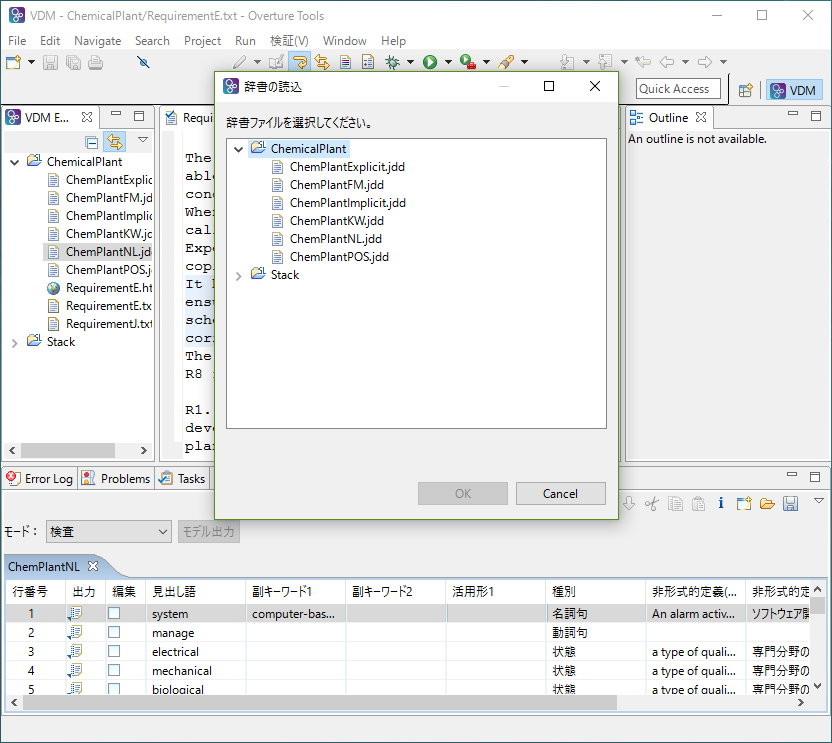

辞書の選択ウィンドウが表示されるので，対象のプロジェクトを選択し，辞書を指定する．

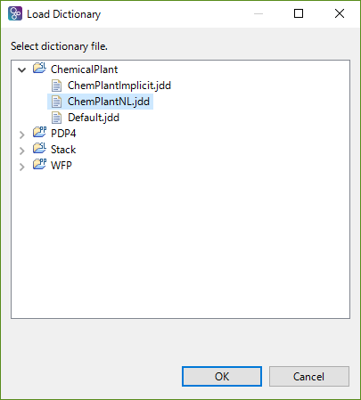

一つのプロジェクトで目的の異なる複数の辞書を同時に開いて用いることも可能である．
 VDM Explorer 上でフォーマルな用語辞書を開こうとすると辞書データが XML としてエディタで表示されてしまうので，注意が必要である．

**このチュートリアルでは辞書名を ChemicalPlant.jdd 等とし，問題領域を化学プラント警報システム，プロジェクト名を AOFA, 入力言語を en と jp, 出力モデルを VDM-SL とする．**

##自然言語テキストの分析

##要求文書の読み込み

自然言語で記述された要求は，ソフトウェア開発の出発点である．
 [JODTool](http://aofa.csce.kyushu-u.ac.jp/JODTool) は，自然言語による plain text または html または，特定のフォーマットの Excel ファイルを読み込むことができる．
文字コードは UTF-8 を想定しており，言語には依存しない．

最初に分析対象となる自然言語記述を，[ファイル追加](#ファイルの追加)の手順によりプロジェクトに追加する．

**このチュートリアルで使用する [Modelling Systems](http://overturetool.org/publications/books/ms2/) の化学プラント要求記述は，[英語版](RequirementE.txt)と[日本語版](RequirementJ.txt)があるので，適当な場所へダウンロードしてプロジェクトへ追加する．**

VDM Explorer はデフォルトでテキストファイルを Textfile Editor で開いてしまうので， [JODTool](http://aofa.csce.kyushu-u.ac.jp/JODTool) を使用するためには，プロジェクトに追加した自然言語による要求ファイルを， VDM Explorer 上で選択し，右クリックで Open with -> Other ... を選択し，仕様書エディター (Specification Editor) を指定する．

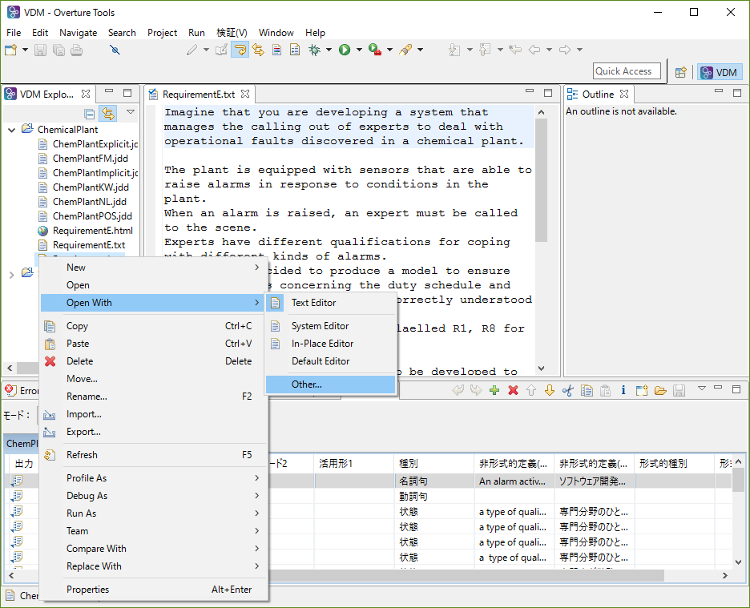

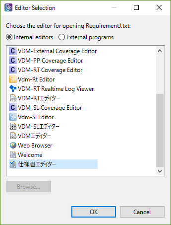

仕様書エディターが使われているかどうかは，メニューバーに「検証」 (Verification) が追加されていれば， Specification Editor が使われていることが確認できる．
ひとつのプロジェクトにおいて，複数の自然言語記述ファイルを同時に開くことも可能である．

##自然言語による意味定義

フォーマルな用語辞書は自然言語サイドと VDM サイドがあり，自然言語サイドは見出し語 (Entry), 副キーワード (sub keyword), 活用形 (conjugation), 種別 (classification), 非形式的定義 (informal definition) からなる．

* 見出し語は見出しであり，分析対象文書のキーフレーズを見出し語とする．
一般的な辞書と異なり，正規表現で表現可能な連語も見出しとすることができる．

* 副キーワードは見出しの同義語や構造化などの結果，見出しと同じ VDM 要素により定義が与えられるフレーズである．
同じ見出しに対して最大 5 つの副キーワードが登録できる．

* 活用形は見出しの文法的な変化形である．
同じ見出しに対して最大 5 つの活用形が登録できる．

* 種別は品詞であり 名詞句 (Noun), 動詞句 (Verb), 状態 (State) のいずれかである．
仕様書エディタ上の色付けは品詞に基づいて行われる．

* 非形式的定義は見出しの自然言語による定義であり，一般的な用語辞書の定義に相当する．
非形式的定義には任意の文章が記述できる．

##自然言語による要求の整理

自然言語による意味定義は仕様書エディターを用いて，

* [キーフレーズの抽出](#キーフレーズの抽出)

* [キーフレーズの自然言語による定義](#キーフレーズの自然言語による定義)

* [キーフレーズの構造定義，関連整理](#キーフレーズの構造定義，関連整理)

を達成するのが目標である．

##キーフレーズの抽出

キーフレーズを仕様書エディタ上で対象の文字列をドラッグして選択し，右クリックしてコンテキストメニューから Verification -> Extract keyword を選択することで，フォーマルな用語辞書の見出しとして登録される．
メニューバー -> Verification -> Extract Keyword または ショートカット Alt+p も同じ操作である．

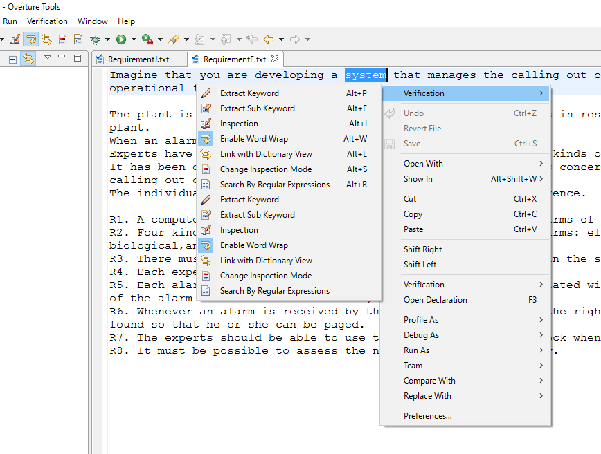

複数の辞書を開いている場合は，どの辞書に登録するか選択画面が表示されるので，任意の辞書を指定する．
開いている辞書が一つだけの場合は，自動的にその辞書へ登録される．

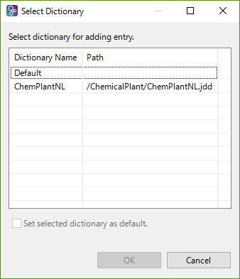

明らかに他の見出しと共通の用語はその見出しの副キーワードとして登録することもできる．
 Dictionary ビューの対象見出しの行を選択し，抽出するキーフレーズをドラッグし，コンテキストメニューから Verification -> Extract sub keyword を選択すればよい．
副キーワードは後から編集可能なので，この時点で厳密に確定する必要はない．

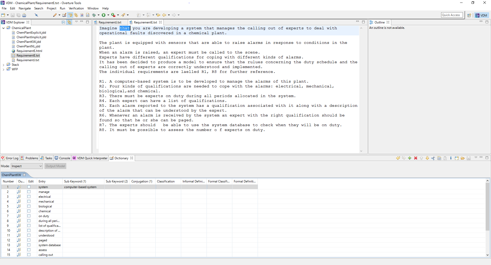

登録した見出しの統計情報は， Dictionary ビュー右上にあるツールバーの i ボタンを押し，登録件数 (Number of Words) タブから参照できる．
ここでは品詞を定義していない見出しが 22 あることが分かる．

分析対象の文書から一渉りキーフレーズを抽出したら，各見出しに品詞を設定する．

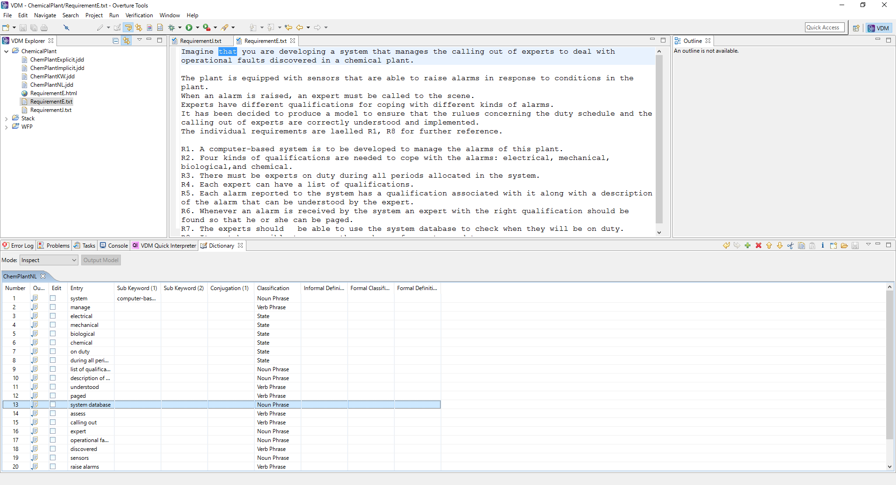

品詞はキーフレーズを抽出するときに同時に設定してもよい．
しかしながら，日本語の文法は曖昧なところがあり，品詞も文章のスタイルの影響を受けるなど絶対ではない[3]．

この段階では，厳密な品詞決定に拘るのではなく，後工程で VDM モデルを書くことも考慮してオブジェクトと機能の識別，独立語とそれ以外の識別を中心に検討する<a id="rfootnote2">[2](#footnote2)</a>．
一渉り，見出しの品詞が設定されたら [JODTool](http://aofa.csce.kyushu-u.ac.jp/JODTool) の仕様書エディターは，見出しと品詞情報に基づいて分析対象のテキストをマーキング(色付け)できる．
 Dictionary ビュー右上にあるツールバーの i ボタンを押し，種別設定タブから設定できる．
色は品詞および一回目かそれ以降かに応じて指定できる．

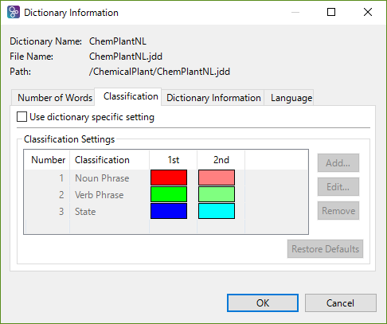

マーキングは，右クリックしてコンテキストメニューから Verification -> Inspection を選択することで，フォーマルな用語辞書の見出しとして登録されている文字列に指定の色をつける．
このとき，元の自然言語テキストと同じ名前で拡張子が html のファイルを出力するので， html を保存するディレクトリを選択する．
メニューバー -> Verification -> Inspection または ショートカット Alt+i も同じ操作である．
このとき，辞書は Inspect Mode になっている必要がある．

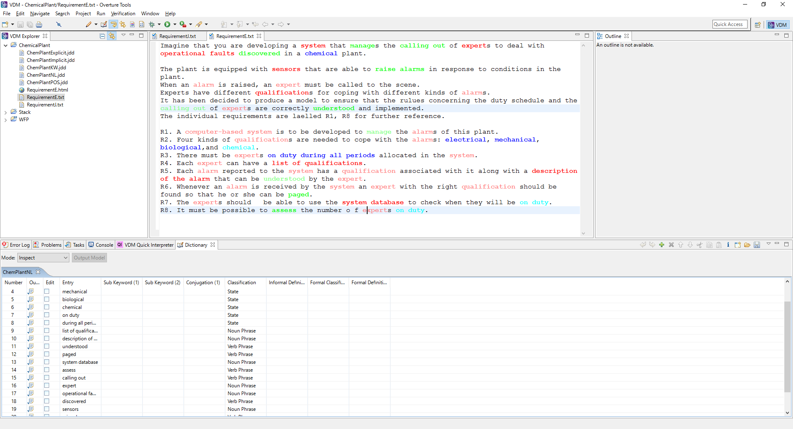

<!--これを利用して，分析対象のテキストに含まれないキーフレーズに品詞を設定しないことで，実用的な違いがなく区別することもできる．-->

マーキングすることにより，辞書から分析対象テキストへのフィードバックを行い，キーフレーズの見落としや余計な抽出の見直しに役立てることができる．

##キーフレーズの自然言語による定義

キーフレーズをフォーマルな用語辞書の見出しとして抽出できたら，それぞれの見出しに自然言語による定義を追加する．
自然言語による定義は VDM モデル化に必須ではないが， VDM を理解しない顧客や関係者への説明，複数の自然言語による要求文書の共通理解に有用である．

フォーマルな用語辞書はプロパティとして設定した入力言語に応じて，各言語による定義を保持することができる．
ここでは，同じ見出しに対して英語と日本語による定義を与えている．

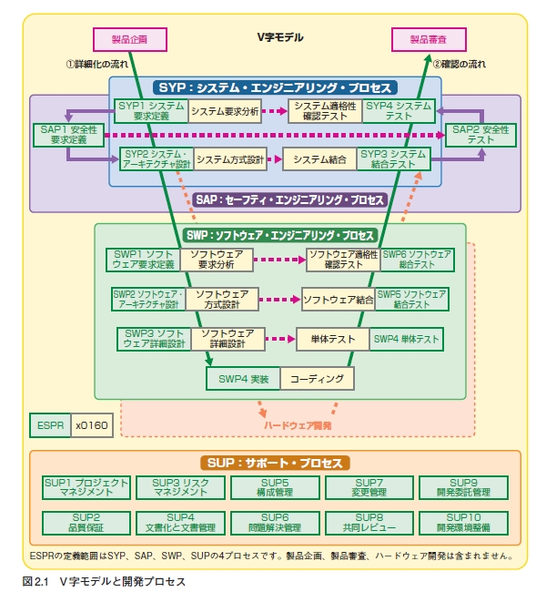

また，自然言語による定義を記述する際に，右クリックしてコンテキストメニューから Verification -> Link with Dictionary View を有効にすることで，選択中のフォーマルな用語辞書の見出しとして登録されている文字列が元の自然言語テキストで現れている部分が強調表示される．
メニューバー -> Verification -> Link with Dictionary View または ショートカット Alt+l も同じ操作である．

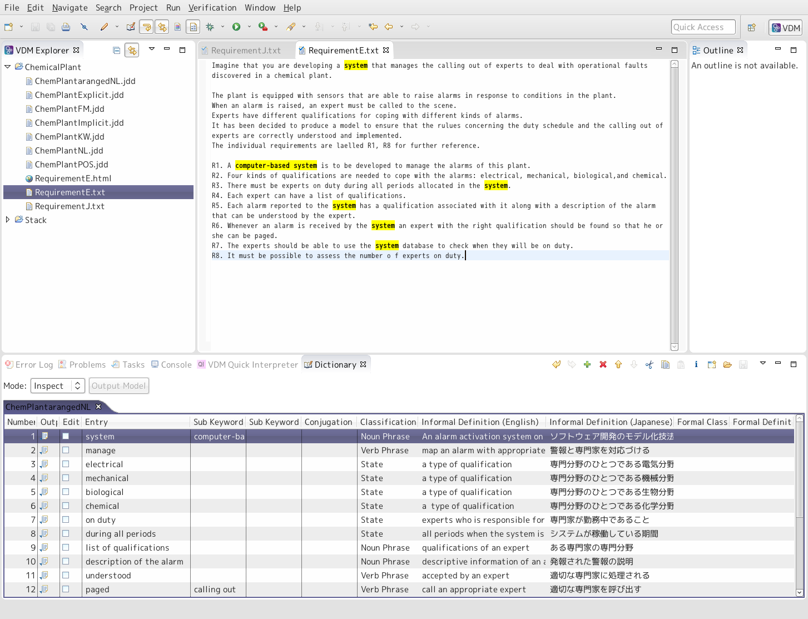

自然言語による定義を検討する際に，各見出しの品詞の見直しや，キーフレーズの取捨選択，モデル化に不足している概念の補完も適宜行い，それでも決定できない要求は顧客に対して問い合わせるなどすることになる．

##キーフレーズの構造定義，関連整理

自然言語による定義とともに，複数のキーフレーズの関連を検討する．
キーフレーズの関連は，同じ対象を指す同義語，複数の対象が同じキーフレーズとして表現される多義語，包含関係，階層関係などさまざまな形態がある．

* 同義語は代表を見出しとし，他のフレーズはフォーマルな用語辞書の sub keyword として同じ意味をもつことを表す

**この例では，  system と computer-based system が同義語である．**

* 多義語は言い換えや適切な修飾語を含めたキーフレーズとすることで，それぞれの意味に対応する見出しをフォーマルな用語辞書に保存する

**この例では， understood が一般的な意味と専門家の理解という異なる意味で用いられている．**

* 包含関係は，集合や型として整理する．

* コンポジット関係は，同じ見出しに整理する．

ここで VDM によるモデル化を意識すると，それぞれの要素の関連として，集合を中心に検討するのが有効である．
**例えば，電気分野，機械分野，生物分野，化学分野はそれぞれ専門分野のひとつであるので，専門分野という集合を型として定義し，それぞれの専門分野を集合の要素としてモデル化できるという包含関係として整理できる．
見出し qualification の副キーワードとして， electrical, mechanical, biological, chemical を整理すると，それぞれの専門分野の定義が qualification の定義に含まれることが明確になる． **

副キーワードを追加すると，最大で 5 個まで欄が追加される．
副キーワードのマーキングは対応する見出しと同じ品詞として扱われる．

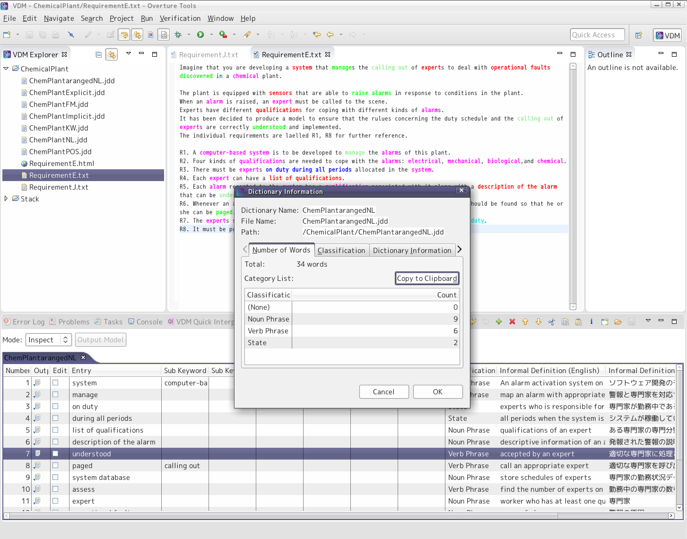

この例では，見出しの数が 17 まで整理されている．

##ＶＤＭによる意味定義

フォーマルな用語辞書は自然言語サイドと VDM サイドがあり， VDM サイドは 形式的種別 (formal classification), 形式的定義 (formal definition) からなる．

 VDM による意味定義はフォーマルな用語辞書を用いて

* [見出しに対応する VDM の要素記述](#見出しに対応するＶＤＭの要素記述)

* [検証可能なモデルの出力と文法および型検査による検証](#検証可能なモデルの出力と文法および型検査による検証)

を達成するのが目標である．

##見出しに対応するＶＤＭの要素記述

自然言語についての検討を基に VDM モデルを記述する．
ここでは， RFC に書かれていない情報についても抽象化や補完により，見出しとして追加する．

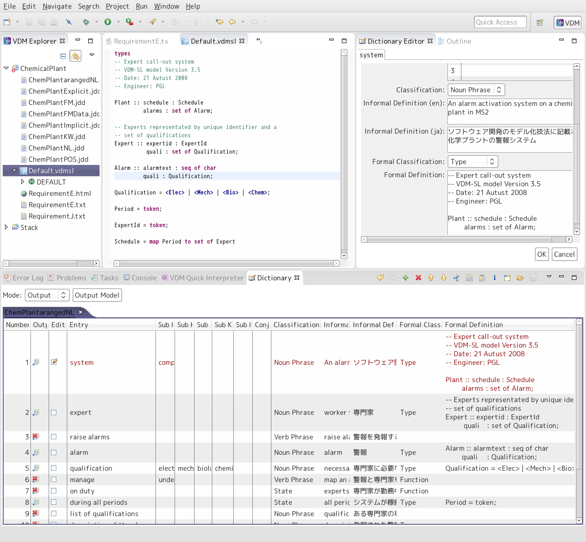

**この例では，以下の type と function を定義する．**

* **Types : Plant, Qualification, Alarm, Period, Expert, Description **
* **Functions : ExpertToPage, ExpertIsOnDuty, NumberOfExperts**

**センサーの処理はモデル化の過程で捨てられている．**
**また，追加された Schedule は system database を抽象化したものと言える．**

 Edit のカラムをチェックすると， Dictionary Editor ビューにより見出しの編集が可能となる．

**ここでは，[Modelling Systems](http://overturetool.org/publications/books/ms2/) の手順に沿って，最初に型の定義を追加し，次に関数の定義を追加する．**

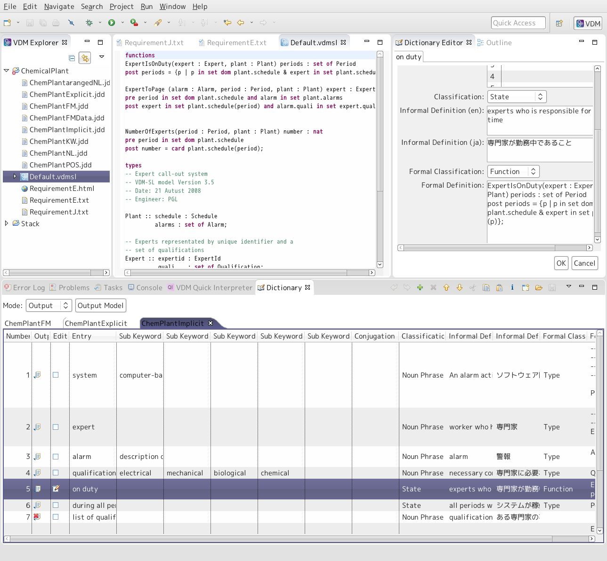

さらに， VDM の定義を見なおして，不変条件や事前条件・事後条件を追加する．

##検証可能なモデルの出力と文法および型検査による検証

 Dictionary ビューにある Output Model ボタンを押すことにより，フォーマルな用語辞書に定義された VDM の要素を [Overture tools](http://overturetool.org) で検証可能な形式で出力できる．
全ての要素を書く前に検証可能な形式で出力するには，出力を抑止する行の Output のカラムをチェックする．
 「Output」 の欄をチェックすると，全体の出力を抑止できる．
このとき，辞書は Output Mode になっている必要がある．

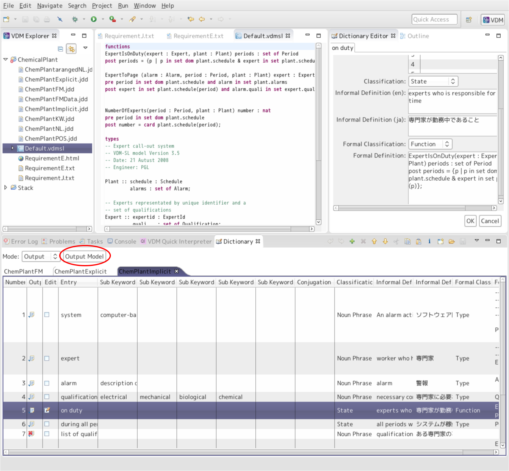

検証可能な形式での出力ファイルの拡張子は，フォーマルな用語辞書に設定された出力モデルの言語に応じて， vdmsl(VDM-SL), vdmpp(VDM++), vdmrt(VDM-RT) となる．
出力した VDM ファイルは [Overture tools](http://overturetool.org) の機能により，即座に文法検査，型検査される．
それぞれの言語のエディターで修正した内容をフォーマルな用語辞書の VDM による意味定義へ反映させ，再度出力して検査する作業を繰り返すことで，型検査済みの VDM の要素と自然言語記述を対応づけることができる．

##モデルの実行

 VDM モデルが陽仕様の場合，

##モデルの改良
 [Overture tools](http://overturetool.org) の機能

<a id="footnote1">[1]</a>: 安定版を公開するまでライセンス，署名は一時的に空欄となっているので，それぞれ accept, OK してほしい．([return](#rfootnote1))

<a id="footnote2">[2]</a>: ここで日本語といっているのは，他の言語はよくわからないという意味であり，他の言語ではないという意味ではない．英語にも性質は異なるが記述スタイルの問題はある．([return](#rfootnote2))

